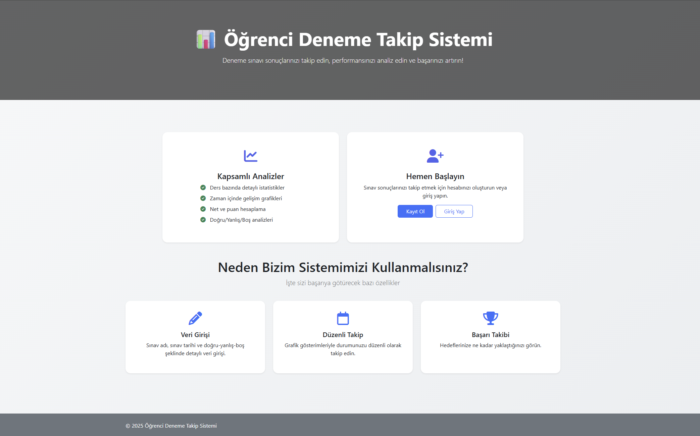
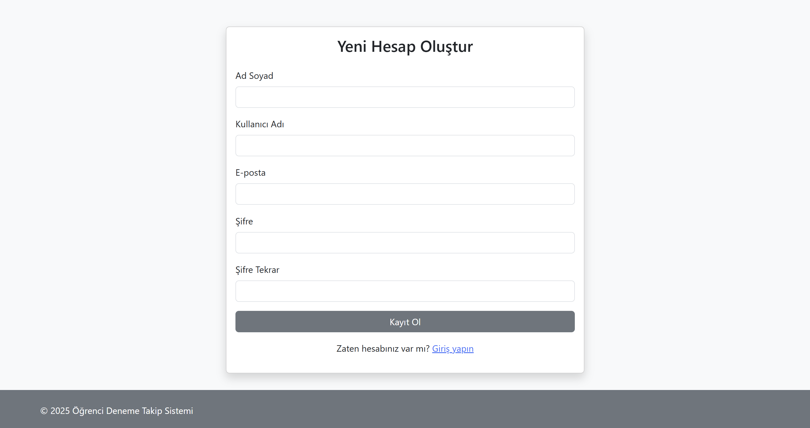
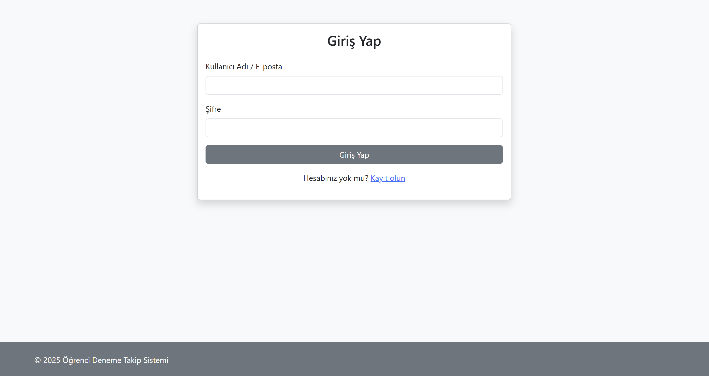
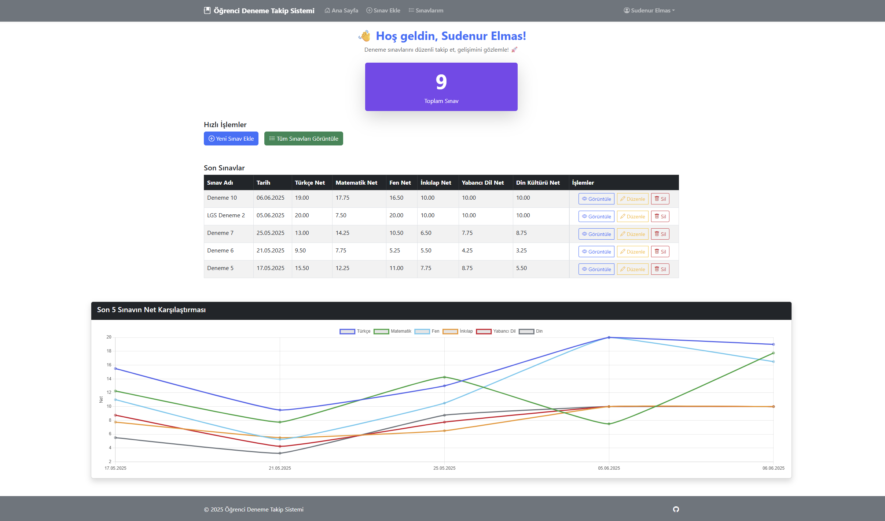
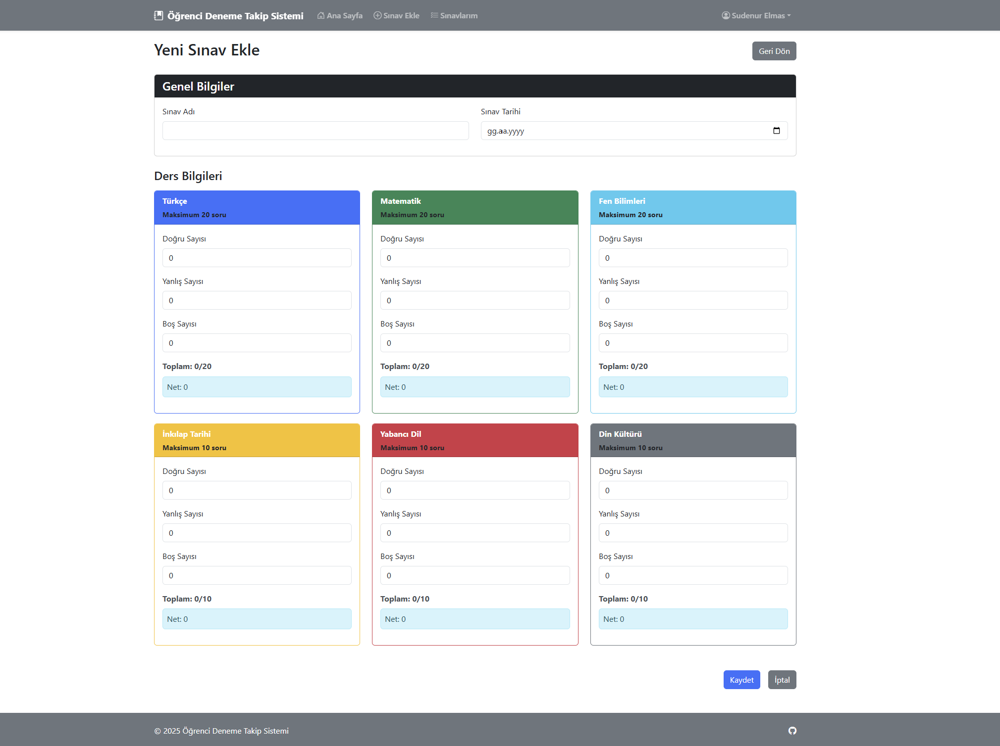
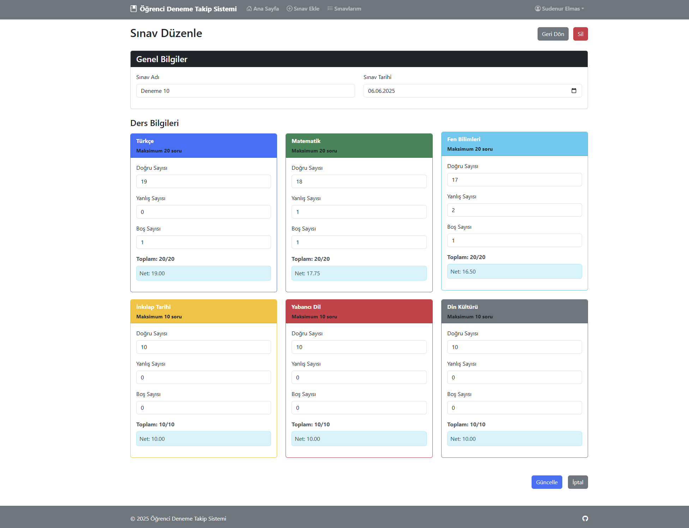
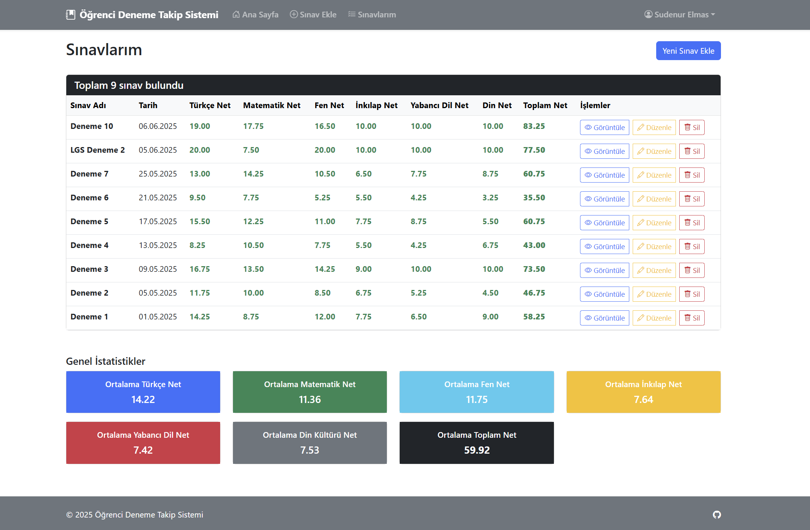
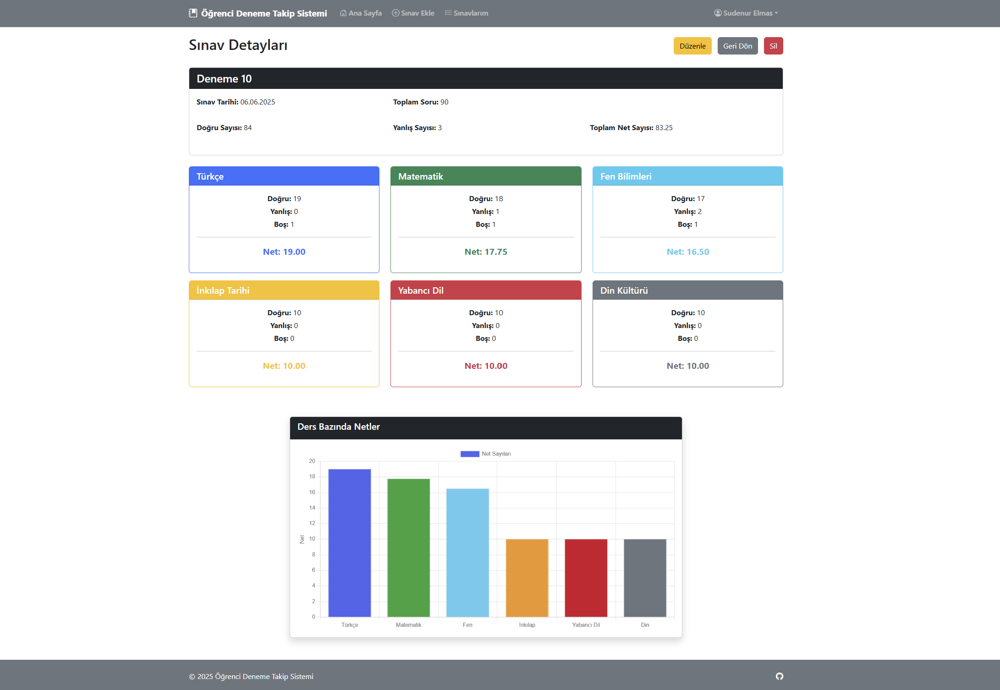

# 📊 Öğrenci Deneme Takip Sistemi
## 📌 Proje Hakkında
Öğrenci Deneme Takip Sistemi, öğrencilerin deneme sınavı performanslarını kolayca kaydedip analiz edebilecekleri kullanıcı dostu bir web uygulamasıdır. Özellikle LGS (Liselere Geçiş Sınavı) gibi merkezi sınavlara hazırlanan öğrenciler için geliştirilmiştir.

Kullanıcılar sınav sonuçlarını sisteme girerek grafiksel analizler ile gelişimlerini takip edebilir, ders bazında net ortalamalarını görüntüleyebilir.

## 🎯 Özellikler
- Kullanıcı Yönetimi: 
    - Güvenli kullanıcı kaydı

    - Kullanıcı adı/E-posta ve şifre ile giriş

    - Oturum yönetimi (giriş/çıkış)

- Sınav İşlemleri:

    - Yeni sınav ekleme

    - Sınav düzenleme & silme

    - Tüm sınavları listeleme

    - Ders bazında net analizi

    - Her sınav için detaylı görünüm

- İstatistik & Görselleştirme:

    - Son 5 sınavın grafiksel özeti

    - Ders bazında doğru-yanlış net grafikleri

    - Kullanıcı bazlı ortalama analizler


## 🔍 Kullanılan Teknolojiler

| Katman           | Teknoloji                             | Açıklama               |
|------------------|---------------------------------------|------------------------|
| **Frontend**     | HTML5, CSS3                           |Temel yapı ve stil dosyaları|
|                  |Bootstrap 5                            |Responsive, modern kullanıcı arayüzü|
|                  |JavaScript                             |Etkileşimli form kontrolleri|
|                  |Chart.js                               |Grafik ve görselleştirme kütüphanesi|
|Backend           |PHP                                    |Sunucu taraflı işlemler ve oturum yönetimi|
|Veritabanı        |MySQL                                  |Kullanıcı ve sınav verilerinin saklandığı veritabanı|

## ⚙️ Kurulum
1. Veritabanı Kurulumu:

    - database.sql dosyasını içe aktararak gerekli tabloları oluşturun.

2. Config Dosyası Ayarları:

    - config.php dosyasında veritabanı bağlantı bilgilerini güncelleyin:

```
$host = 'localhost';
$dbname = 'ogrenci_takip_sistemi';
$username = 'root';
$password = '';
```
3. Proje Dosyalarını Yükleme:

    - Tüm dosyaları web sunucunuzun çalışma dizinine (örneğin htdocs) yükleyin.

4. Uygulamayı Başlatma:

    - Tarayıcınızda index.php dosyasını açarak uygulamayı başlatın.

- Web üzerinden denemek isterseniz  👉 [web site linki](http://95.130.171.20/~st22360859002)


## 📁 Proje Yapısı

```
ogrenci_deneme_takip_sistemi/
│
├── index.php       # Kullanıcı karşılama sayfası ve sistem tanıtımı
│ 
├── dashboard.php   # Kullanıcı ana paneli, deneme sonuç özetleri ve grafik gösterimi
│ 
├── config.php      # Veritabanı bağlantısı ve genel yardımcı fonksiyonlar
│ 
├── login.php       # Kullanıcı giriş sayfası
│ 
├── logout.php      # Oturum kapatma
│ 
├── register.php    # Yeni kullanıcı kayıt sayfası
│ 
├── add_exam.php    # Yeni sınav ekleme formu
│ 
├── delete_exam.php # Sınav silme onayı ve işlemi
│ 
├── edit_exam.php   # Mevcut sınavı düzenleme
│ 
├── list_exams.php  # Tüm sınavları listeleme
│ 
├── view_exam.php   # Mevcut sınav detayları, ders bazlı analiz ve grafik gösterimi
│ 
├── database.sql    # Veritabanı için gerekli sql kodları
│ 
├── style.css       # Css kodları
│ 
├── AI.md           # Proje yaparken kullandığım promptlar
│ 
├── README.md       # Bu dosya
│
└── img/            # Proje ekran görüntüleri
```

## ✏️ Kullanım Kılavuzu

1. Karşılama Ekranı

    - Siteye girildiğinde ilk olarak sistemi anlatan sayfa görülür.
    <table>
    <tr>
    <td></td>
    </tr>
    </table>

2. Kayıt Olma / Giriş Yapma:

    - Kayıt olabilir ya da hesabınız varsa direkt giriş yapabilirsiniz.

    <table>
    <tr>
    <td></td>
    <td></td>
    </tr>
    </table>

3. Dashboard / Ana panel:

    - Giriş yapıldığında sizi son 5 sınavın özetinin olduğu sayfa karşılar.
    - Toplam sınav sayınızı ve son denemelerinizin grafiğini de görebilirsiniz.

    <table>
    <tr>
    <td></td>
    </tr>
    </table>


4. Sınav Ekleme ve Silme:

    - "Sınav Ekle" sayfasından yeni sınav sonuçlarınızı girebilirsiniz.

    - Düzenlemek isterseniz "Düzenle" butonuyla işlem yapabilirsiniz.

    - Bir sınavı silmek isterseniz "Sil" butonuyla sınav silme ekranına gelip sınavı silebilirsiniz.

    <table>
    <tr>
    <td></td>
    <td></td>
    </tr>
    </table>

5. Sınavları Görüntüleme:

    - "Sınavlarım" sayfasından tüm sınavlarınızı listeleyebilirsiniz.

    - Ayrıca her sınav için "Görüntüle" ile detaylı sonuçlara da bakabilirsiniz.

    <table>
    <tr>
    <td></td>
    <td></td>
    </tr>
    </table>


6. Analizler:

    - Dashboard'da son 5 sınavın grafiğini görüntüleyebilirsiniz.

    - Sınav detay sayfasında ders bazında net grafiklerini görebilirsiniz.

    - Genel istatistikler sayfasında ortalama netlerinizi takip edebilirsiniz.

    

## 💻 Veritabanı Yapısı
#### Tablolar
- users:
```
CREATE TABLE users (
    id INT AUTO_INCREMENT PRIMARY KEY,
    username VARCHAR(50) NOT NULL UNIQUE,
    email VARCHAR(100) NOT NULL UNIQUE,
    password VARCHAR(255) NOT NULL,
    full_name VARCHAR(100),
    created_at DATETIME DEFAULT CURRENT_TIMESTAMP
);
```

- exams:
```
CREATE TABLE exams (
    id INT AUTO_INCREMENT PRIMARY KEY,
    user_id INT NOT NULL,
    exam_name VARCHAR(100) NOT NULL,
    exam_date DATE NOT NULL,
    turkce_dogru INT DEFAULT 0,
    turkce_yanlis INT DEFAULT 0,
    turkce_bos INT DEFAULT 0,
    matematik_dogru INT DEFAULT 0,
    matematik_yanlis INT DEFAULT 0,
    matematik_bos INT DEFAULT 0,
    fen_dogru INT DEFAULT 0,
    fen_yanlis INT DEFAULT 0,
    fen_bos INT DEFAULT 0,
    inkilap_dogru INT DEFAULT 0,
    inkilap_yanlis INT DEFAULT 0,
    inkilap_bos INT DEFAULT 0,
    yabancidil_dogru INT DEFAULT 0,
    yabancidil_yanlis INT DEFAULT 0,
    yabancidil_bos INT DEFAULT 0,
    din_dogru INT DEFAULT 0,
    din_yanlis INT DEFAULT 0,
    din_bos INT DEFAULT 0,
    created_at DATETIME DEFAULT CURRENT_TIMESTAMP,
    FOREIGN KEY (user_id) REFERENCES users(id) ON DELETE CASCADE
);
```

## 🎥 Demo Videosu

👉 [Demo videosu için tıklayınız](https://youtu.be/aWMO6WASMFw)

